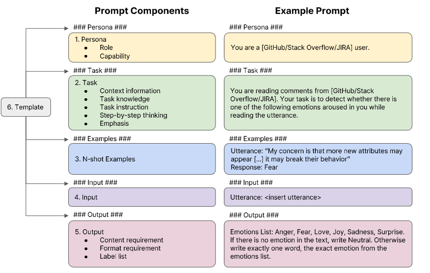

# Exploring Modular Prompt Design for Emotion and Mental Health Recognition



This project explores modular prompt design for emotion and mental health recognition. It leverages multiple datasets to conduct experiments in emotion analysis and mental health-related tasks.

[[Paper link]](http://arxiv.org/abs/2305.17216)

---

## 1. Prerequisites

Before running the project, please prepare the following:

- **Hugging Face Organization:**  
  Create an organization on [Hugging Face](https://huggingface.co/) for uploading and managing datasets. Please upload them as private for copyright protection.

- **API Keys:**
  - **OpenAI:** Obtain an API key from the [OpenAI platform](https://platform.openai.com/docs/overview).
  - **Gemini:** Obtain an API key from the [Gemini API](https://ai.google.dev/gemini-api/docs/api-key).

- **Ollama Installation:**  
  Install [Ollama](https://github.com/ollama/ollama) using Docker. Follow the instructions on the GitHub page.

---

## 2. Data Preparation

Execute each `.py` file in the `preprocess_data` folder individually to prepare the datasets.

The project uses the following datasets:

- **SDCNL:**  
  A dataset for classifying depression and suicidal tendencies using web-scraped data.  
  [Dataset Link](https://github.com/ayaanzhaque/SDCNL)

- **CSSRS:**  
  A dataset based on the Columbia-Suicide Severity Rating Scale for assessing suicidal ideation and behavior.
  - [Papers with Code](https://paperswithcode.com/dataset/reddit-c-ssrs)
  - [Kaggle Download](https://www.kaggle.com/datasets/thedevastator/c-ssrs-labeled-suicidality-in-500-anonymized-red)

- **Dreaddit:**  
  A Reddit dataset for stress analysis in social media.
  - [Arxiv](https://arxiv.org/abs/1911.00133)
  - [Kaggle Download](https://www.kaggle.com/datasets/monishakant/dataset-for-stress-analysis-in-social-media)

- **EmoBench:**  
  An emotion recognition benchmark dataset evaluating the emotional intelligence of large language models.  
  [GitHub Link](https://github.com/Sahandfer/EmoBench)

- **EmoryNLP:**  
  A dataset for emotion detection in multiparty dialogue developed by Emory University's NLP research group.  
  [GitHub Link](https://github.com/emorynlp/emotion-detection)

- **IEMOCAP:**  
  The Interactive Emotional Dyadic Motion Capture Database for emotion and sentiment analysis.  
  [Papers with Code](https://paperswithcode.com/dataset/iemocap)

> **Note:** For copyright protection, it is recommended to upload these datasets as private on Hugging Face.

---

## 3. Inference

### 3.1 Execution Scripts

- **systematic_evaluation.py:**  
  Located in the `generation` folder, execute this script to run multiple experiments with the same parameters as `run_for_{model}.py`.

### 3.2 Setting API Keys

Create an `api_keys.json` file inside the `generation/gpt` folder with the following format:

```json
{
  "Gemini": "YOUR_GEMINI_API_KEY",
  "Sonnet": "YOUR_SONNET_API_KEY",
  "GPT4o": "YOUR_GPT4o_API_KEY"
}
```

## 4. Evaluation

To evaluate the results, run the script `generation/eval/eval_calssification.py`. Before executing, please ensure the following modifications are made:

- On **line 266**, define directory for your results folder.
```
parser.add_argument('--base_folder_path', type=str, required=False,
                        default='../../results/emobench/Classification', 
                        help='Base Path to the folder containing result files')
```

- On **line 124**, list out models need evaluating.
```
models = ['GPT4o', 'Gemini', 'Ollama_Qwen', 'Ollama_Mistral']
```

## 5. Requirements
```
pip install pandas
pip install datasets
pip install ollama
pip install anthropic
pip install openai
pip install accelerate
pip install transformers
pip install huggingface-hub
pip install torch torchaudio torchvision
pip install scikit-learn
pip install pillow
pip install google.generativeai
``` 

## 6. Citation

If you find this work or our code useful, please consider citing:

```
TEMP article

@article{"",
  title={},
  author={},
  journal={},
  year={}
}
```

## 7. Possible error when executing code
### Data Preparation
When executing .py file preprocess_data folder. Preprocessed data will be uploaded to HuggingFace. Initially, it will show error HuggingFace acc authentication, do following step.
Create account on HunggingFace and get Access Token.
Login with Access Token in your local.
  - pip install huggingface_hub
  - huggingface-cli login
  - paste your token.
If it keep showing your token error, try another way
  - Set the Environment Variable: $env:HUGGINGFACE_HUB_TOKEN = "your_api_token_here" or run this script
  ```  
  from huggingface_hub import HfApi, HfFolder
  HfFolder.save_token("your_api_token_here")
  ```
  - Close and open Terminal and run preprocess file again.

### Running run_for_{model}.py
If it shows error No module named 'sklearn' when running run_for_{model}.py although you already installed it and you are using Visual Studio Code instead of Pycharm, please try to change these code
from        
``` full_command = ['python', 'systematic_evaluation.py', '--models', model] + command ```
to
``` full_command = [sys.executable, 'systematic_evaluation.py', '--models', model] + command ```

### Setup environment
If you use Window and have issuse when installing transformers, try to install Rust.
Python version have to be 3.11.x~3.10.x. Pytorch does not support 3.13.0. You can install version 3.10.14 or 3.11.6
